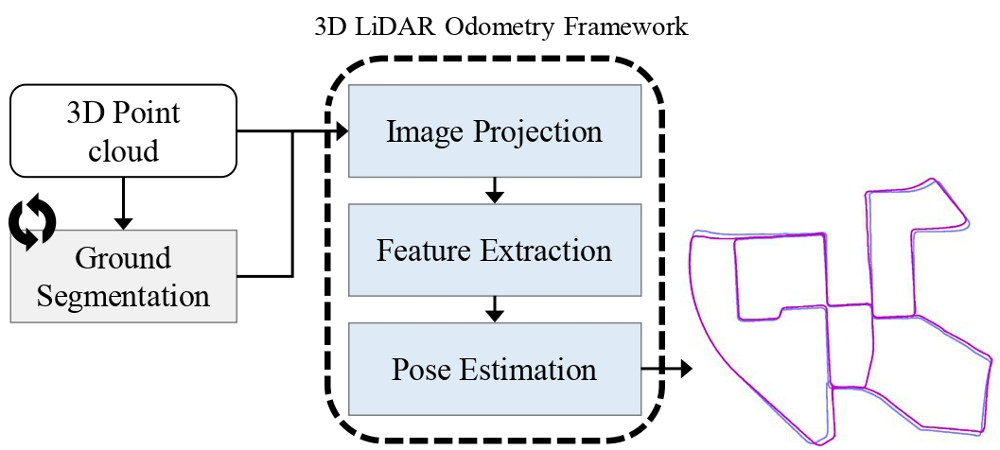
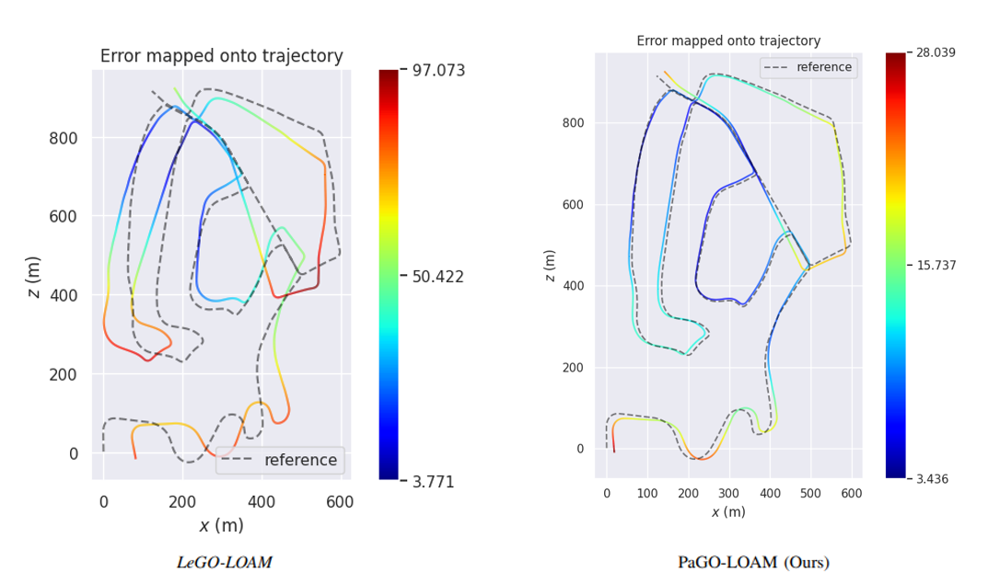

# PaGO-LOAM

**A LiDAR odometry framework that can easily test the ground-segmentation algorithms.**

The page for ***PaGO-LOAM: Robust Ground-Optimized LiDAR Odometry***, a LiDAR odometry framework based on *LeGO-LOAM*, in which it is easy and straightforward to test whether ground segmentation algorithms help extract features and improve SLAM performance. By leveraging the SOTA ground segmentation method ***Patchwork***, the system takes in the raw point cloud and ground point cloud for estimating the odometry. 



## Requirements

- [ROS](http://wiki.ros.org/ROS/Installation) (tested with melodic)
- [gtsam](https://github.com/borglab/gtsam/releases) (Georgia Tech Smoothing and Mapping library, 4.0.0-alpha2)
    
```cpp
wget -O ~/Downloads/gtsam.zip https://github.com/borglab/gtsam/archive/4.0.0-alpha2.zip
cd ~/Downloads/ && unzip gtsam.zip -d ~/Downloads/
cd ~/Downloads/gtsam-4.0.0-alpha2/
mkdir build && cd build
cmake ..
sudo make install
```
    

- If you want to test the ground segmentation method [Patchwork](https://github.com/LimHyungTae/patchwork) like us,

```
sudo apt-get install ros-melodic-jsk-recognition
sudo apt-get install ros-melodic-jsk-common-msgs
sudo apt-get install ros-melodic-jsk-rviz-plugins
```
    

## Build

1. In utility.h, there are 5 parameters you could set
    
```
extern const string pointCloudTopic = "/benchmark/ground_estimate";
extern const bool alterGround = true;
extern const bool loopClosureEnableFlag = false;
std::string RESULT_PATH ="/data/bagfiles/KITTI_BAG/pago_pose_result.txt";
std::string TIME_PATH ="/data/bagfiles/KITTI_BAG/pago_pose_time.txt";
```

    - pointCloudTopic should have the format as (Refer to cloud_msgs/ground_estimate.msg):
        
    ```
    std_msgs/Header header
    sensor_msgs/PointCloud2 curr
    sensor_msgs/PointCloud2 ground 
    ```
        
    ‘*curr*‘ for raw point cloud, ‘*ground*‘ for ground segmented point cloud. 
        
    - *alterGround* is for deciding whether to use another ground segmentation method such as ***Patchwork*** or one from baseline LeGO-LOAM.
    - *loopClosureEnableFlag* for loop-closure.
    - *RESULT_PATH* and *TIME_PATH* for the odometry estimation result.
    
2. Compile

```cpp
mkdir -p ~/catkin_ws/src
cd ~/catkin_ws/src
git clone https://github.com/url-kaist/AlterGround-LeGO-LOAM
cd .. && catkin build pago_loam
```

## KITTI Example

1. Download [KITTI Odometry](http://www.cvlibs.net/datasets/kitti/eval_odometry.php) dataset
2. Convert Lidar bin files to rosbag files using ****[lidar2rosbag_KITTI](https://github.com/AbnerCSZ/lidar2rosbag_KITTI)**** (If you are in urobot students, just use pre-made bagfiles!)
3. Run the ground segmentation algorithm. (e.g. *Patchwork*)

```cpp
roslaunch patchwork pub_for_legoloam.launch
```

4. Run the ***PaGO-LOAM*** and KITTI bagfile

```cpp
roslaunch pago_loam run.launch
rosbag play /${Your dataset}/${kitti_bagfile}.bag --clock
```

## Odometry Estimation

Using [evo package](https://github.com/MichaelGrupp/evo), you could estimate the pose errors e.g:

1. *LeGO-LOAM* fundamentally doesn’t give the first 2\~3 poses because it doesn’t estimate the odometry poses when initializes. **So please compare the # of difference between ground-truth and estimated odometry, and remove the first 2~3 poses of ground-truth.**

```cpp
evo_ape kitti KITTI_00_gt.txt pago_pose_result.txt -va --plot --plot_mode xz --save_results results/KITTI_pago.zip --align
```

2. Or, by converting the result to **TUM** format using the attached file *kitti_to_tum.ipnyb*, you can run the *evo* **without removing the poses**.

```cpp
evo_ape tum KITTI_00_gt.txt pago_pose_result.txt -va --plot --plot_mode xz --save_results results/KITTI_pago.zip --align
```



The result on Seq.02 of the KITTI dataset
